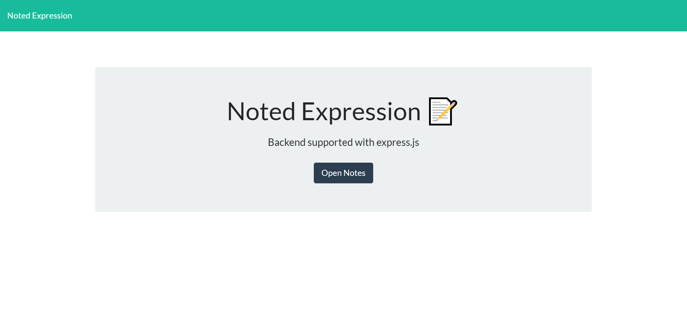

  # Noted Expression
  

  ## Description
  A note-taking app for users to be able to add and delete notes that can be used to delegate everyday tasks.

  [Click on this link to access the application!](https://noted-expression.herokuapp.com/ )

  
  
  ## Table of Contents
  * [Installation](#installation)
  * [Usage](#usage)
  * [License](#license)
  * [Contributing](#contributing)
  * [Tests](#tests)
  * [Questions](#questions)

  
  ## Installation 
  Follow these instructions to install the necessary dependences:
  Install `node.js`.  When installed, open application in an editor (i.e VS Code).  Then, `npm init` for node environment setup.  Next, `npm install` for the `express` package, `uuid` (for unique ids to be attached to notes), and optionally `nodemon` as a dev dependency to keep from having to restart the express routing connection.

  
  ## Usage 
  Follow these instructions to use the application properly:
  `npm run start` can initialize the router to be able to visit `http://localhost:3005/` from a web browser, or you can use an API service platform like `Insomnia` or `Postman`.  You could also use the `npm run dev` script if you have nodemon installed to allow the package to read every update to the editor without pause.  From there, you can make adjustments to the code, or you can test the get, post, and delete requests. 
  
  
  ## License 

  **Noted Expression** is distributed under the [MIT](https://opensource.org/licenses/MIT) License
    

  
  ## Contributing
   Contributors: Malik Spruill

  
  ## Tests 
  Include these tools to properly run tests within the application:
  N/A 
  
  
  ## Questions
  Have questions about the repo/application? Contact me:
  <a href="https://github.com/Malik Spruill" target="_blank">https://github.com/Malik Spruill</a> 
  Email: malikspruill@gmail.com
   
